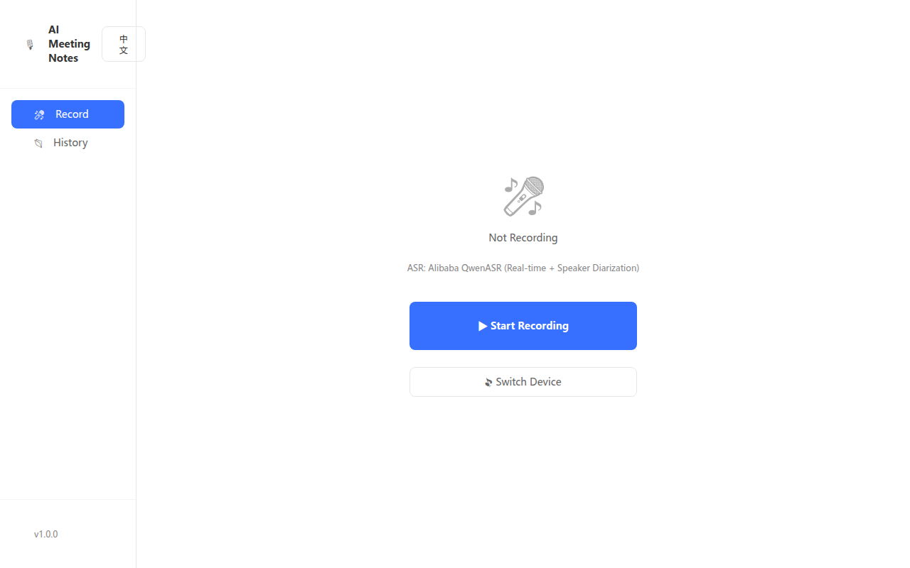
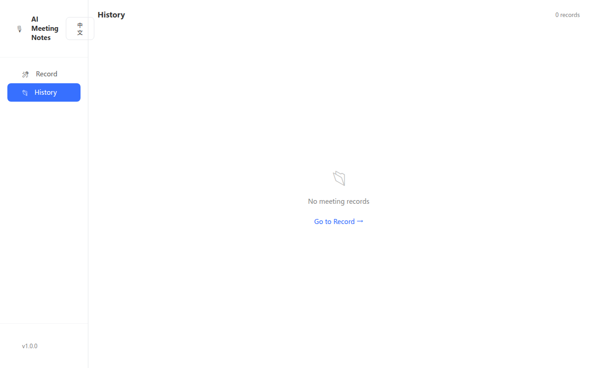

# AI Meeting Notes

> Record meetings locally → Get transcripts + AI summaries instantly

[English](#english) · [中文](#中文)

**当前状态:** V1 开发完成 · [GitHub](https://github.com/linuxhsj/meeting-notes) · [Project 进度](#status)

---

## Status

**V1 MVP — 开发完成 ✅**

| 功能 | 状态 | 说明 |
|------|------|------|
| 录制页三状态 | ✅ | 空闲/录制中/异常 |
| 实时转写 | ✅ | 阿里云 QwenASR |
| 说话人分离 | ✅ | 阿里云内置，支持 8 人 |
| AI 摘要 | ✅ | 通义千问/Kimi，含超时+错误处理 |
| 数据持久化 | ✅ | JSON，崩溃可恢复 |
| 配置加密 | ✅ | electron-store 加密存储 |
| 中英双语 | ✅ | 默认英语，点击切换中文 |
| 打包配置 | ✅ | electron-builder 已配置 |
| E2E 测试 | ✅ | 10/10 测试通过 |

**V2 计划:** PDF 导出 · Azure 说话人分离 · 多语言支持

---

## English

---

## English

### What it does

```
🎙 Record   →   📝 Transcribe   →   🤖 AI Summary   →   📋 Export
     │              │                   │               │
  your mic     real-time text     key decisions       copy
```

**AI Meeting Notes** captures your meeting audio locally, transcribes it in real-time with speaker detection, then generates an AI summary when you're done. No cloud upload, no API fees for transcription.

### Features

| Feature | Description |
|---------|-------------|
| 🎙 **Local Recording** | Captures system audio via ffmpeg — no internet needed during recording |
| 🗣 **Speaker Detection** | Auto-separates speakers (pyannote.audio), click to rename |
| 📡 **Live Transcript** | Streamed text appears as you talk |
| 🤖 **AI Summary** | Generates action items and decisions after recording stops |
| 💾 **Crash Recovery** | Auto-saves every 30 seconds |
| 📋 **Copy to Clipboard** | One-click copy as formatted Markdown |
| 🌐 **Bilingual** | English / Chinese UI, switch anytime |

### Screenshots

#### Recording Page


#### History Page


---

*If screenshots are missing, run the app with `npm run dev` and take screenshots manually, then save them to the `images/` folder.*

#### Notes Page
```
┌─────────────────────────────────────────────┐
│ 📋 This Meeting           [Edit]            │
│─────────────────────────────────────────────│
│ 📌 AI Summary                               │
│  本次会议明确了 Q3 目标：                    │
│  ① 完成 MVP 核心功能开发                    │
│  ② 建立 CI/CD 流水线                        │
│  负责人：后端 @张三，前端 @李四              │
│─────────────────────────────────────────────│
│ [张三] [李四] [王五] +merge                 │
│─────────────────────────────────────────────│
│ 🟦 张三 · 00:00                             │
│  好的，今天我们来同步一下 Q3 的项目进度...  │
│                                              │
│ 🟩 李四 · 00:01:23                          │
│  我这边后端 API 框架已经搭好了...            │
│─────────────────────────────────────────────│
│ [📋 Copy All] [💬 Re-generate] [✏️ Edit]   │
└─────────────────────────────────────────────┘
```

### Tech Stack

```
Audio Input        MediaRecorder API (browser)
ASR               阿里云 QwenASR (WebSocket, speaker diarization)
AI Summary         通义千问 / Kimi API (user provides key)
Frontend          React 18 + TailwindCSS + React Router
Desktop           Electron 28
Persistence       Local JSON + electron-store (encrypted)
```

### Getting Started

#### Prerequisites

- Node.js 18+
- ffmpeg (auto-downloaded on first run, or install via `apt install ffmpeg`)

#### Install & Run

```bash
git clone https://github.com/linuxhsj/meeting-notes.git
cd meeting-notes
npm install
npm run dev          # starts Electron + React dev server
```

#### Build

```bash
npm run build        # produces .exe / .AppImage in /release
```

#### Configure AI Summary

Open the app → click **Settings** (bottom-left) → paste your API key:
- 通义千问 API Key, 或
- Kimi API Key

---

## 中文

### 产品介绍

```
🎙 录制   →   📝 转写   →   🤖 AI 摘要   →   📋 导出
   │            │              │              │
 麦克风      实时文字       决策行动项       一键复制
```

**AI 会议纪要** 在本地捕获会议音频，实时转写文字并自动区分说话人，录制完成后生成 AI 摘要。数据不出本机，转写免费。

### 核心功能

| 功能 | 说明 |
|------|------|
| 🎙 **本地录制** | 通过 ffmpeg 捕获系统音频，录制过程无需联网 |
| 🗣 **说话人分离** | pyannote.audio 自动区分，点击可编辑姓名 |
| 📡 **实时转写** | 边说边看，流式文字输出 |
| 🤖 **AI 摘要** | 录制完成后自动生成行动项和决策摘要 |
| 💾 **崩溃恢复** | 每 30 秒自动保存，断电可恢复 |
| 📋 **一键导出** | 复制全文为 Markdown 格式 |
| 🌐 **双语界面** | 中文 / 英文，随时切换 |

### 界面预览

#### 录制页
```
┌─────────────────────────────────────────────┐
│  🎙  AI 会议纪要                             │
│──────┬──────────────────────────────────────│
│ 🎤   │                                      │
│ 录制 │        ┌──────────────┐               │
│──────│        │   🔴 00:08   │  ← 实时计时  │
│ 📂   │        │  正在录制中  │               │
│ 历史 │  ┌─────────────────────────────┐     │
│      │  │ 📡 实时转写                  │     │
│      │  │ 🟦 说话人 1 · 00:03          │     │
│      │  │ "好的，今天我们来同步..."   │     │
│      │  │ 🟩 说话人 2 · 00:04          │     │
│      │  │ "我这边后端 API 已..."       │     │
│      │  └─────────────────────────────┘     │
│      │  💾 每 30 秒自动保存                  │
│      │  ┌─────────┐  ┌─────────┐            │
│      │  │ ⏹ 停止 │  │ 📋 纪要 │            │
│      │  └─────────┘  └─────────┘            │
└─────────────────────────────────────────────┘
```

#### 纪要页
```
┌─────────────────────────────────────────────┐
│ 📋 项目进度同步会        [编辑]              │
│─────────────────────────────────────────────│
│ 📌 AI 摘要                                    │
│  本次会议明确了 Q3 目标：                    │
│  ① 完成 MVP 核心功能开发                    │
│  ② 建立 CI/CD 流水线                        │
│  负责人：后端 @张三，前端 @李四              │
│─────────────────────────────────────────────│
│ [张三] [李四] [王五] +合并                   │
│─────────────────────────────────────────────│
│ 🟦 张三 · 00:00                              │
│  好的，今天我们来同步一下 Q3 的项目进度...  │
│                                              │
│ 🟩 李四 · 00:01:23                           │
│  我这边后端 API 框架已经搭好了...            │
│─────────────────────────────────────────────│
│ [📋 复制全文] [💬 重新生成] [✏️ 编辑]       │
└─────────────────────────────────────────────┘
```

### 技术架构

```
音频捕获        MediaRecorder API（浏览器原生）
ASR            阿里云 QwenASR（WebSocket，支持说话人分离）
AI 摘要         通义千问 / Kimi API（用户自填 Key）
前端            React 18 + TailwindCSS + React Router
桌面框架        Electron 28
数据持久化      本地 JSON + electron-store（加密存储）
```

### 快速开始

#### 环境要求

- Node.js 18+
- ffmpeg（首次运行自动下载，或手动 `apt install ffmpeg`）

#### 安装运行

```bash
git clone https://github.com/linuxhsj/meeting-notes.git
cd meeting-notes
npm install
npm run dev          # 启动 Electron + React 开发模式
```

#### 打包

```bash
npm run build        # 在 /release 目录生成安装包
```

#### 配置 AI 摘要 Key

打开应用 → 左下角 **设置** → 填入你的 API Key：
- 通义千问 API Key，或
- Kimi API Key

---

## License

MIT · [linuxhsj/meeting-notes](https://github.com/linuxhsj/meeting-notes)